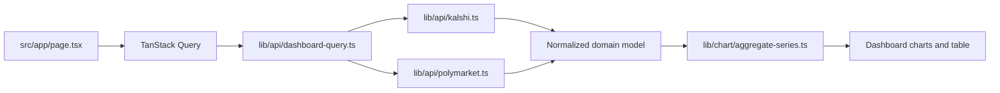

# Prediction Markets Volume Dashboard

Dashboard исторического торгового объёма для Kalshi и Polymarket. Приложение показывает реальные данные публичных API, позволяет фильтровать их по периоду, категории и платформе, сравнивать метрики и просматривать список загруженных рынков.

## Возможности

- Исторический график объёма Kalshi и Polymarket.
- Диапазоны: `7d`, `30d`, `90d` и `all`.
- Фильтрация по категориям: Politics, Weather, Sports.
- Фильтрация по платформе: обе платформы, только Kalshi или только Polymarket.
- Сохранение диапазона, категорий, платформы и выбранной метрики в URL.
- Кнопки Back/Forward браузера восстанавливают состояние dashboard.
- Таблица рынков с поиском и сортировкой по объёму, платформе, категории и названию.
- Переключатель метрик:
  - общий объём;
  - средний дневной объём;
  - количество рынков.
- Category share pie chart.
- Period delta: сравнение первой и второй половины выбранного периода.
- Приближение графика колесом мыши, drag/pinch и нижним zoom-слайдером.
- Экспорт графика в PNG/SVG и данных в CSV.
- Светлая и тёмная тема с сохранением выбора.
- Русский, английский и китайский языки с сохранением выбора.
- Loading, empty, no-data, partial-error и retry-состояния.
- Счётчики отправленных и неуспешных API-запросов по платформам.

## Запуск

Требования: Node.js с npm и доступ к публичным API Kalshi и Polymarket.

```bash
npm install
npm run dev
```

Откройте [http://localhost:3000](http://localhost:3000).

Секреты и API keys для используемых read-only endpoints не нужны.

## Команды

```bash
npm run dev          # локальная разработка
npm run build        # production build
npm run start        # запуск production build
npm run lint         # ESLint
npm run typecheck    # TypeScript без генерации файлов
npm run test         # все unit-тесты Vitest
npm run test:e2e     # Playwright-тесты, если они добавлены
npm run format       # форматирование
npm run format:check # проверка форматирования
```

Перед изменениями рекомендуется запускать:

```bash
npm run typecheck
npm run lint
npm run test
```

## Архитектура



Основные границы кода:

- `src/app/page.tsx` собирает страницу, читает URL-состояние и запускает query.
- `src/lib/api/` содержит запросы, валидацию, pagination, retry и нормализацию данных.
- `src/types/market.ts` содержит общую модель `Market`, `VolumePoint`, `Platform` и метрик.
- `src/lib/chart/aggregate-series.ts` отвечает за UTC-агрегацию и подготовку series.
- `src/lib/url-state.ts` парсит и сериализует состояние dashboard.
- `src/lib/i18n.tsx` содержит typed-переводы, locale-aware даты и валюты.
- `src/components/dashboard/` содержит фильтры, графики, summary, статусы и таблицу.

React Query владеет server state. URL владеет shareable UI state. Локальное состояние компонентов используется только для поведения таблицы, например для текста поиска и выбранной сортировки.

## Источники данных

### Kalshi

Используются публичные endpoints:

```text
GET https://api.elections.kalshi.com/trade-api/v2/events
GET https://api.elections.kalshi.com/trade-api/v2/series/{series_ticker}/markets/{ticker}/candlesticks
```

Запрос событий выполняется отдельно для `open` и `closed` с `with_nested_markets=true`. Из ответа используются:

- `event_ticker`;
- `series_ticker`;
- `category`;
- вложенные markets;
- `ticker`;
- `title`;
- `volume_fp`;
- `volume_24h_fp`;
- `status`;
- `created_time`.

История запрашивается через candlesticks с параметрами `start_ts`, `end_ts` и `period_interval=1440`.

### Polymarket

Используются публичные endpoints:

```text
GET https://gamma-api.polymarket.com/markets/keyset
GET https://data-api.polymarket.com/v2/trades
```

Из market metadata используются:

- `id`;
- `conditionId`;
- `question`;
- `tags`;
- `volumeNum`;
- `closed`.

История собирается из trades. Для каждой сделки используется количество токенов:

```text
volume = size
```

Pagination у обоих источников cursor-based. Cursor не преобразуется и передаётся обратно в следующий запрос.

## Нормализация и сопоставимость

Обе платформы приводятся к общей модели:

```ts
type Market = {
  id: string;
  platform: "kalshi" | "polymarket";
  title: string;
  category: { id: string; label: string };
  volumeMetric: "contract-notional-usd" | "outcome-token-count";
  source: Record<string, boolean | number | string | null>;
};

type VolumePoint = {
  timestamp: number;
  volumeUsd: number | null;
  marketId: string;
  categoryId: string;
  platform: "kalshi" | "polymarket";
};
```

Метрики платформ теперь сопоставимы:

| Платформа  | Исходная метрика                  | Что отображается                     |
| ---------- | --------------------------------- | ------------------------------------ |
| Kalshi     | Количество контрактов `volume_fp` | Количество проторгованных контрактов |
| Polymarket | Количество токенов `size`         | Количество проторгованных токенов    |

Обе платформы показывают **количество проторгованных единиц** (контракты для Kalshi, outcome токены для Polymarket), а не денежный оборот. Это делает график сравнением торговой активности, а не cash turnover.

## Ограничение cohort

Для ограничения количества запросов dashboard выбирает максимум `15` рынков на категорию каждой платформы:

```ts
const TOP_MARKETS_PER_CATEGORY = 15;
```

Kalshi сортируется по `volume_fp`, Polymarket по `volumeNum`. Поэтому таблица показывает загруженный cohort, а не полный каталог всех рынков платформ.

Для расширения поиска по всему каталогу потребуется отдельный paginated market search или отдельный query, а не простое изменение UI-фильтра.

## Агрегация графика

Агрегация выполняется в UTC:

| Диапазон | Bucket                |
| -------- | --------------------- |
| `7d`     | день                  |
| `30d`    | день                  |
| `90d`    | неделя с понедельника |
| `all`    | месяц                 |

Дубликаты удаляются по комбинации платформы, рынка, timestamp и категории. Если у платформы нет значения в bucket, сохраняется `null`, а не ноль.

Zoom графика меняет видимую область уже загруженного ряда. Он не делает новый запрос и не создаёт точки, которых нет в выбранной агрегации. Для более детального ряда нужно выбрать меньший диапазон.

## Метрики dashboard

### Общий объём

Сумма всех ненулевых `volumeUsd` после применения фильтров категории и платформы.

### Средний дневной объём

```text
total volume / number of days in selected range
```

Для `all` число дней определяется по диапазону timestamps доступных точек.

### Количество рынков

Количество нормализованных рынков текущего загруженного cohort после фильтра платформы.

### Period delta

Текущая реализация сравнивает суммы первой и второй половины агрегированного ряда:

```text
(second half - first half) / first half * 100
```

Это не сравнение с предыдущим календарным периодом. Для такого сравнения потребуется дополнительная загрузка данных до начала выбранного периода.

## URL-состояние

Примеры:

```text
/?range=30d
/?range=7d&categories=politics,sports
/?range=30d&platforms=kalshi
/?range=90d&platforms=kalshi,polymarket&metric=average
/?range=7d&categories=&metric=markets
```

Параметры:

- `range`: `7d`, `30d`, `90d`, `all`;
- `categories`: отсортированный список category id через запятую;
- отсутствие `categories`: все категории;
- пустой `categories=`: категории не выбраны;
- `platforms`: `kalshi`, `polymarket` или оба значения;
- отсутствие `platforms`: обе платформы;
- `metric`: `total`, `average`, `markets`;
- отсутствие `metric`: `total`.

Изменение URL фильтрами использует `router.push(..., { scroll: false })`, поэтому страница не прыгает наверх. History entries сохраняются, поэтому Back/Forward восстанавливают фильтры.

## Ошибки, retry и rate limits

`src/lib/api/errors.ts` централизованно обрабатывает:

- HTTP errors;
- network errors;
- `429`;
- `5xx`;
- заголовок `Retry-After`;
- отмену через `AbortSignal`.

Временные ошибки повторяются до двух раз. Каждая фактическая попытка запроса увеличивает счётчик `sent`, а HTTP/network failure увеличивает `failed`. При частичной ошибке одна платформа может продолжать отображаться, пока ошибка другой показывается в warning-блоке.

## Интерфейс

### Язык

Доступны `en`, `ru`, `zh`. Выбор сохраняется в `localStorage` под ключом `prediction-markets-locale`. Формат даты и валюты меняется вместе с locale, а `html lang` получает `en`, `ru` или `zh-CN`.

### Тема

При первом открытии используется `prefers-color-scheme`. После ручного выбора тема сохраняется в `localStorage` под ключом `prediction-markets-theme` и больше не зависит от системной темы.

### Доступность

- Используются семантические `button`, `label`, `input`, `select` и `table`.
- Интерактивные элементы имеют focus-visible стили.
- Loading и ошибки имеют `role`/`aria-live` там, где это необходимо.
- ECharts включает accessibility mode и имеет текстовое screen-reader summary.
- Таблица на узких экранах прокручивается горизонтально, а не ломает layout.

## Тестирование

Unit-тесты находятся рядом с доменной логикой:

- `src/lib/api/*.test.ts` — API contracts, ошибки, pagination и normalizers;
- `src/lib/chart/aggregate-series.test.ts` — UTC-агрегация и edge cases;
- `src/lib/url-state.test.ts` — диапазоны, категории, платформы и метрики.

## Известные ограничения

- API может вернуть `429`; повторная загрузка зависит от rate limit источника.
- Полный архив всех рынков не загружается: используется bounded top-15 cohort на категорию.
- Kalshi и Polymarket используют разные определения объёма.
- `all` означает все доступные observations выбранного cohort, а не полный архив платформы.
- Табличный поиск работает по уже загруженным рынкам; он не ищет удалённо по всему каталогу.
- Средний дневной объём является производной оценкой и зависит от доступного диапазона данных.
- Автоматическое realtime-обновление не включено, чтобы не создавать лишние запросы к rate-limited API.
